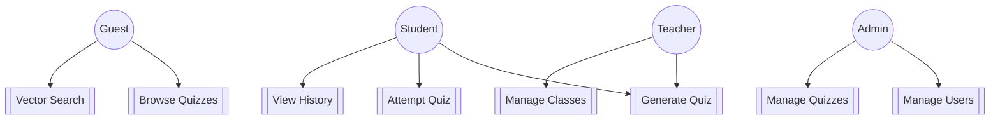
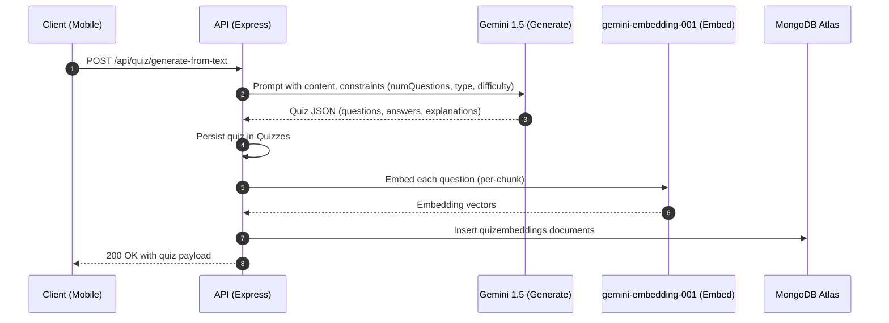

# ARCHITECTURE

This document captures QuizCraft’s architecture, diagrams, and key design notes for AI generation and vector search.


## System Architecture (High Level)
```mermaid path=null start=null
flowchart LR
  subgraph Client[Mobile App (React Native / Expo)]
    UI[UI Screens]\nAuth\nUpload\nQuiz\nSearch\nAnalytics
  end

  subgraph API[Backend (Node.js / Express)]
    AuthAPI[Auth & RBAC]
    Ingest[Ingest: PDF/OCR]
    Gen[AI Quiz Generation]
    Emb[Embedding Service]
    SearchAPI[Vector/Text Search]
    QuizAPI[Quiz CRUD & Attempts]
    HistAPI[History]
    AdminAPI[Admin]
  end

  subgraph DB[MongoDB Atlas]
    Users[(users)]
    Quizzes[(quizzes)]
    QEmb[(quizembeddings)\nVector Index: quizembeddings_vector_index]
    Hist[(quizhistories)]
    Cats[(categories)]
    Tags[(tags)]
    Classes[(classes)]
  end

  Client <--> API
  API <--> DB
  Gen --uses--> GEMINI{{Google Gemini 1.5}}
  Emb --uses--> GEM_EMB{{gemini-embedding-001}}
```


## Use Case Diagram (Abbreviated)



## ER Diagram (Primary Collections)
```mermaid path=null start=null
erDiagram
  USERS ||--o{ QUIZZES : "createdBy"
  USERS ||--o{ QUIZHISTORIES : "attempts"
  USERS ||--o{ CLASSES : "owns/manages"
  QUIZZES ||--o{ QUIZEMBEDDINGS : "per-question chunks"
  QUIZZES }o--o{ CATEGORIES : "tagged"
  QUIZZES }o--o{ TAGS : "tagged"

  USERS {
    string _id
    string name
    string email
    string role  "guest|student|teacher|admin"
    string subscriptionTier
  }
  QUIZZES {
    string _id
    string title
    string description
    string difficulty
    string language
    string category
    string[] tags
    string createdBy
    object[] questions
  }
  QUIZEMBEDDINGS {
    string _id
    string quizId
    number questionIndex
    float[ ] embedding  "gemini-embedding-001"
  }
  QUIZHISTORIES {
    string _id
    string userId
    string quizId
    number score
    number timeTaken
    date   attemptedAt
  }
  CLASSES {
    string _id
    string ownerId
    string name
    string[] studentIds
  }
  CATEGORIES {
    string _id
    string name
  }
  TAGS {
    string _id
    string name
  }
```


## DFD (Level 0)
```mermaid path=null start=null
flowchart LR
  User[User (All Roles)] -->|Requests| API[(QuizCraft API)]
  API -->|AuthZ/AuthN| Users[(users)]
  API -->|CRUD| Quizzes[(quizzes)]
  API -->|Attempts| Hist[(quizhistories)]
  API -->|Search| QEmb[(quizembeddings)]
  API -->|Generate| Gemini[(Gemini 1.5)]
  API -->|Embed| Emb[(gemini-embedding-001)]
```


## DFD (Level 1: Generate & Embed Path)



## Vector Search Notes
- Embedding model: gemini-embedding-001
- Index: quizembeddings_vector_index (cosine similarity)
- Strategy: per-question chunk embeddings for better recall and explainable matches
- Typical pipeline (Atlas $vectorSearch) with optional text filter fallback

Example Atlas Vector Index (JSON)
```json path=null start=null
{
  "mappings": {
    "dynamic": false,
    "fields": {
      "embedding": {
        "type": "knnVector",
        "dimensions": 768,
        "similarity": "cosine"
      },
      "quizId": { "type": "string" },
      "questionIndex": { "type": "number" },
      "tags": { "type": "string" },
      "category": { "type": "string" }
    }
  }
}
```


## AI Generation Notes
- Models: Gemini 1.5 Pro (quality) or 1.5 Flash (latency)
- Prompting: constrain count, types, difficulty, language; require explanations
- Validation: sanitize and validate AI output before save


## Operational Considerations
- Quotas: enforce per-role usage limits server-side
- Security: JWT auth, RBAC, rate limiting, file size limits
- Performance: background/embed batching, index warmup
- Observability: structured logs in dev, monitor Atlas metrics


## Change Log (Docs)
- Consolidated README/QUICKSTART/etc. into two files: README.md and ARCHITECTURE.md
- Updated to gemini-embedding-001 and Gemini 1.5 (Pro/Flash)
